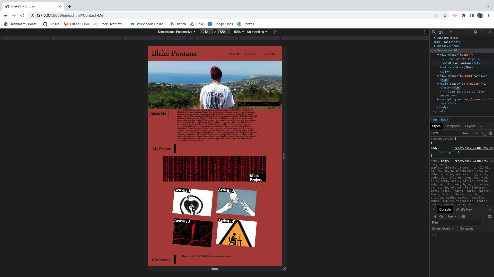

# My-Portfolio
My Professional Portfolio includes examples of my skills and previous work.
Description:
For this project I created an HTML page that will feature information about myself, as well as future projects.
I started by writing out all of the HTML code and then focusing on CSS in order to style the page so it breaks nicely, has tilted images, and wraps cleanly.

[Deployed Application](https://blakelikestoast.github.io/My-Portfolio/)

